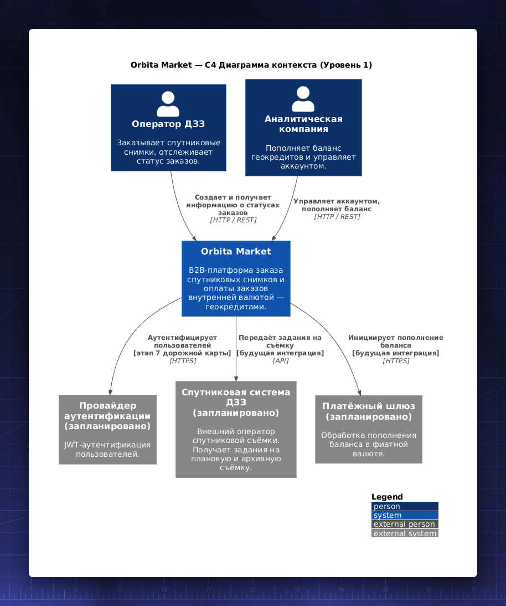
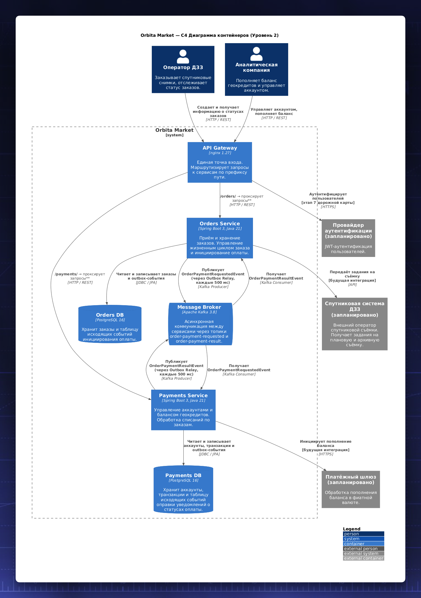

Orbita Market — B2B-платформа заказа спутниковых снимков. Пользователи размещают заказы трёх типов (архив, плановая съёмка, мониторинг) и оплачивают их внутренней валютой — **геокредитами**.

Архитектура — два независимых сервиса с собственными БД, общий Kafka-брокер, nginx-шлюз и библиотека общих утилит.

- [Ссылки](#ссылки)
- [Компоненты](#компоненты)
- [Структура проекта](#структура-проекта)
- [Технологический стек](#технологический-стек)
- [Архитектура](#архитектура)
- [Предварительные требования](#предварительные-требования)
- [Запуск](#запуск)
  - [Полный стек через Docker Compose](#полный-стек-через-docker-compose)
  - [Локальный запуск сервиса с Testcontainers](#локальный-запуск-сервиса-с-testcontainers)
- [Переменные окружения и конфигурация](#переменные-окружения-и-конфигурация)
  - [Orders Service](#orders-service)
  - [Payments Service](#payments-service)
  - [Общие параметры (`shared`)](#общие-параметры-shared)
- [API](#api)
  - [Orders Service (префикс: `/orders`)](#orders-service-префикс-orders)
  - [Payments Service (префикс: `/payments`)](#payments-service-префикс-payments)
- [Тесты](#тесты)
  - [Виды тестов](#виды-тестов)
- [Надёжность и корректность](#надёжность-и-корректность)
  - [Гарантированная доставка событий — Transactional Outbox](#гарантированная-доставка-событий--transactional-outbox)
  - [Идемпотентность обработки платежей](#идемпотентность-обработки-платежей)
  - [Защита от параллельного списания](#защита-от-параллельного-списания)
  - [Идемпотентность обновления статуса заказа](#идемпотентность-обновления-статуса-заказа)
- [Анализ безопасности](#анализ-безопасности)
- [Документация](#документация)

## Ссылки

Автотесты: [orbita-autotests](https://github.com/spanic/orbita-autotests)

Тесты API: [orbita-bruno-collections](https://github.com/spanic/orbita-bruno-collections)


## Компоненты

| Модуль             | Тип            | Порт                    | Описание                                                                                 |
| ------------------ | -------------- | ----------------------- | ---------------------------------------------------------------------------------------- |
| `shared`           | library jar    | —                       | Общие утилиты: Transactional Outbox, Kafka-события, HTTP-перехватчик идентификации, DTO. |
| `orders-service`   | executable jar | `8081`                  | Приём и хранение заказов. Управление жизненным циклом заказа и инициирование оплаты.     |
| `payments-service` | executable jar | `8082`                  | Управление аккаунтами и балансом геокредитов. Обработка списаний по заказам.             |
| `gateway`          | nginx image    | `8080` (доступен извне) | Единая точка входа. Проксирует `/orders/**` и `/payments/**` к соответствующим сервисам. |

## Структура проекта

```
orbita/
├── docker-compose.yaml
├── mvnw / mvnw.cmd
├── pom.xml                          # корневой POM (BOM, Lombok, плагины)
│
├── shared/                          # library jar
│   └── src/main/java/.../shared/
│       ├── config/                  # PersistenceConfig, UserIdHeaderProperties
│       ├── dto/                     # ErrorResponse
│       ├── error/                   # BaseExceptionHandler, ErrorCode, коды ошибок
│       ├── event/                   # Kafka-контракты: события и топики
│       ├── outbox/                  # Transactional Outbox: OutboxEvent, OutboxRelay
│       └── web/                     # UserIdHeaderInterceptor
│
├── orders-service/
│   ├── Dockerfile
│   └── src/
│       ├── main/java/.../orders/
│       │   ├── config/              # JpaConfig, KafkaTopicConfig, PricingProperties
│       │   ├── controller/          # OrdersController, OrdersApi
│       │   ├── dto/                 # CreateOrderRequest, *Payload
│       │   ├── error/               # OrderNotFoundException, ExceptionHandler
│       │   ├── listener/            # OrderPaymentResultListener
│       │   ├── mapper/              # PayloadMapperRegistry, *PayloadMapper
│       │   ├── model/               # Order (STI), OrderStatus, OrderTypes, SensorType
│       │   ├── repository/          # OrderRepository
│       │   └── service/             # OrderService, OrderProcessingService
│       └── test/java/.../orders/
│           ├── controller/          # OrdersControllerTest (@WebMvcTest)
│           ├── repository/          # OrdersServiceRepositoryIntegrationTest (@DataJpaTest)
│           └── service/             # OrderServiceIntegrationTest, OrderPaymentResultServiceIntegrationTest
│
├── payments-service/
│   ├── Dockerfile
│   └── src/
│       ├── main/java/.../payments/
│       │   ├── config/              # JpaConfig, KafkaTopicConfig
│       │   ├── controller/          # PaymentsController, PaymentsApi
│       │   ├── dto/                 # CreateAccountRequest, TopUpAccountRequest, AccountBalanceResponse
│       │   ├── error/               # AccountNotFoundException, AccountAlreadyExistsException, ExceptionHandler
│       │   ├── listener/            # PaymentRequestListener
│       │   ├── mapper/              # CreateAccountRequestMapper
│       │   ├── model/               # Account, PaymentTransaction, PaymentOutcome
│       │   ├── repository/          # AccountRepository, PaymentTransactionRepository
│       │   └── service/             # AccountService, PaymentProcessingService
│       └── test/java/.../payments/
│           ├── controller/          # PaymentsControllerTest (@WebMvcTest)
│           ├── repository/          # AccountsRepositoryIntegrationTest (@DataJpaTest)
│           └── service/             # AccountServiceTest, PaymentProcessingServiceIntegrationTest
│
├── gateway/
│   ├── Dockerfile
│   ├── nginx.conf
│   └── proxy-common.conf
│
└── docs/
    ├── c4-context.puml              # C4 Level 1: системный контекст
    ├── c4-containers.puml           # C4 Level 2: контейнеры
    ├── payment-flow.puml            # Диаграмма последовательности: поток оплаты
    └── analytics.sql                # Аналитические SQL-запросы
```

## Технологический стек

- **Java 21**, Spring Boot 4.1.0, Maven (multi-module reactor)
- **Spring Web MVC**, Spring Data JPA (PostgreSQL 16), Spring for Apache Kafka 3.8
- **Apache Kafka** — асинхронная коммуникация между сервисами
- **Transactional Outbox** — гарантированная доставка событий в Kafka
- **Lombok** — кодогенерация
- **Testcontainers** (PostgreSQL + Kafka) — интеграционные тесты
- **JUnit 5** — фреймворк для тестирования

## Архитектура


## Предварительные требования

- **JDK 21+**
- **Docker** и **Docker Compose** — для запуска полного стека или интеграционных тестов
- (Опционально) **Maven 3.9+** — либо используйте прилагаемый `./mvnw`

## Запуск

### Полный стек через Docker Compose

```bash
docker compose up --build
```

| Сервис           | URL                                 |
| ---------------- | ----------------------------------- |
| Orders Service   | http://localhost:8080/orders        |
| Payments Service | http://localhost:8080/payments      |
| Orders DB        | localhost:5432 (внутри Docker-сети) |
| Payments DB      | localhost:5433 (внутри Docker-сети) |
| Kafka            | localhost:9092 (внутри Docker-сети) |

### Локальный запуск сервиса с Testcontainers

`TestOrdersServiceApplication` / `TestPaymentsServiceApplication` автоматически поднимают PostgreSQL и Kafka через Testcontainers — ручная настройка инфраструктуры не нужна. Запустите из IDE или:

```bash
./mvnw -pl orders-service spring-boot:test-run
./mvnw -pl payments-service spring-boot:test-run
```

## Переменные окружения и конфигурация

### Orders Service

| Переменная окружения      | Параметр конфигурации            | Значение по умолчанию                     |
| ------------------------- | -------------------------------- | ----------------------------------------- |
| `ORDERS_DB_URL`           | `spring.datasource.url`          | `jdbc:postgresql://localhost:5432/orders` |
| `ORDERS_DB_USER`          | `spring.datasource.username`     | `orders`                                  |
| `ORDERS_DB_PASSWORD`      | `spring.datasource.password`     | `orders`                                  |
| `KAFKA_BOOTSTRAP_SERVERS` | `spring.kafka.bootstrap-servers` | `localhost:9092`                          |
| `ORDERS_UNIT_PRICE`       | `orders.pricing.unit-price`      | `100.00` (геокредитов за единицу заказа)  |
| `SERVER_PORT`             | `server.port`                    | `8081`                                    |

### Payments Service

| Переменная окружения      | Параметр конфигурации            | Значение по умолчанию                       |
| ------------------------- | -------------------------------- | ------------------------------------------- |
| `PAYMENTS_DB_URL`         | `spring.datasource.url`          | `jdbc:postgresql://localhost:5432/payments` |
| `PAYMENTS_DB_USER`        | `spring.datasource.username`     | `payments`                                  |
| `PAYMENTS_DB_PASSWORD`    | `spring.datasource.password`     | `payments`                                  |
| `KAFKA_BOOTSTRAP_SERVERS` | `spring.kafka.bootstrap-servers` | `localhost:9092`                            |
| `SERVER_PORT`             | `server.port`                    | `8082`                                      |

### Общие параметры (`shared`)

| Параметр конфигурации                     | Значение по умолчанию | Описание                                          |
| ----------------------------------------- | --------------------- | ------------------------------------------------- |
| `app.user-id-header`                      | `X-User-Id`           | Имя HTTP-заголовка для идентификации пользователя |
| `spring.jackson.property-naming-strategy` | `SNAKE_CASE`          | Формат полей JSON                                 |

> `spring.jpa.hibernate.ddl-auto=update` — временное решение для разработки; перед production необходимо заменить на Flyway или Liquibase для обеспечения миграций БД.

## API

Каждый сервис доступен через gateway по адресу `http://localhost:8080`.

### Orders Service (префикс: `/orders`)

| Метод  | Путь           | Описание                                            |
| ------ | -------------- | --------------------------------------------------- |
| `POST` | `/orders`      | Создать заказ (тип: ARCHIVE / TASKING / MONITORING) |
| `GET`  | `/orders`      | Получить список заказов текущего пользователя       |
| `GET`  | `/orders/{id}` | Получить заказ по ID                                |

### Payments Service (префикс: `/payments`)

| Метод  | Путь                | Описание                        |
| ------ | ------------------- | ------------------------------- |
| `POST` | `/accounts`         | Создать аккаунт                 |
| `GET`  | `/accounts`         | Получить информацию об аккаунте |
| `GET`  | `/accounts/balance` | Получить текущий баланс         |
| `POST` | `/accounts/top-up`  | Пополнить баланс геокредитов    |

Идентификатор пользователя передаётся через заголовок `X-User-Id` в каждом запросе.

> Можно использовать любое значение заголовка, например `luke-i-am-your-father`.

Healthcheck и информация о сервисе: `GET /orders/actuator/health`, `GET /payments/actuator/health`.

## Тесты

```bash
# Полная сборка со всеми тестами (требует Docker для интеграционных тестов)
./mvnw clean verify

# Только юнит-тесты и @WebMvcTest (без Docker)
./mvnw test -Dtest='!*ApplicationTests,!*IntegrationTest' -DfailIfNoTests=false

# Все тесты одного модуля
./mvnw -pl orders-service test
./mvnw -pl payments-service test
```

### Виды тестов

| Вид            | Аннотация / класс               | Docker | Что проверяет                                   |
| -------------- | ------------------------------- | ------ | ----------------------------------------------- |
| Юнит           | `@ExtendWith(MockitoExtension)` | Нет    | Изолированная бизнес-логика сервисов            |
| Web-слой       | `@WebMvcTest`                   | Нет    | HTTP-контракт контроллеров, валидация запросов  |
| Интеграционный | `@SpringBootTest`               | Да     | Полный контекст приложения с PostgreSQL + Kafka |

Инфраструктура для интеграционных тестов поднимается автоматически через Testcontainers с `@ServiceConnection`

## Надёжность и корректность

### Гарантированная доставка событий — Transactional Outbox

Событие оплаты и запись в БД сохраняются в **одной транзакции**. Отдельный планировщик (Outbox Relay) публикует накопленные события в Kafka. Это исключает ситуацию, когда заказ сохранён, но событие оплаты потеряно (или наоборот).

### Идемпотентность обработки платежей

`PaymentTransaction` имеет уникальное ограничение по `order_id`. При повторном получении одного и того же события payments-service обнаруживает существующую транзакцию и повторно публикует уже записанный результат — без повторного списания.

### Защита от параллельного списания

Баланс аккаунта защищён **оптимистичной блокировкой** (`@Version`): при конкурентном обновлении одного аккаунта проигравшая транзакция получает исключение и откатывается, деньги не списываются дважды.

### Идемпотентность обновления статуса заказа

Orders-service применяет результат оплаты только если заказ находится в статусе `PAYMENT_PENDING`. Повторное событие для уже обработанного заказа игнорируется.

## Анализ безопасности

Отчёты и таблица триажа: [`security/`](security/triage.md). Инструменты: Gitleaks, Semgrep (`auto`, `p/owasp-top-ten`, `p/java`, `p/security-audit`). Найдено 3 проблемы (2 средних, 1 низкий), утечек секретов нет.

## Документация

PlantUML-диаграммы находятся в `docs/`:

- `c4-context.puml` — системный контекст (C4 Level 1)
- `c4-containers.puml` — контейнеры и взаимодействие (C4 Level 2)
- `payment-flow.puml` — поток создания и оплаты заказа (sequence diagram)





Там же находится SQL-запрос для аналитики: `analytics.sql`, и примеры его исполнения на тестовых данных


